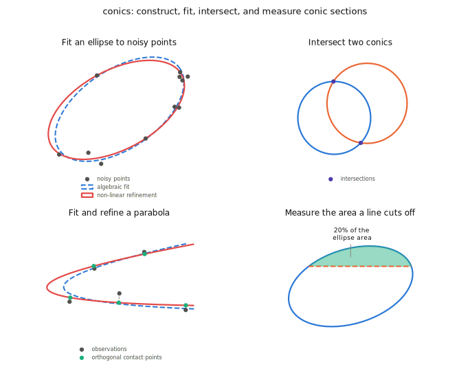

# Conics


[](https://codecov.io/gh/sergiud/conics)
[](https://conics.readthedocs.io/en/latest/?badge=latest)


A conic (or conic section) is the curve you get by slicing a cone with a
plane. Depending on the angle of the cut, that curve is a circle, an
ellipse, a parabola, or a hyperbola. These shapes show up constantly in
science and engineering, from the orbits of planets to the way a camera
projects a circle into an ellipse, so working with them well is worth doing
properly instead of ad hoc.

Conics is a Python library for constructing, fitting, transforming, and
intersecting conic sections. It covers the numerically tricky parts, such
as fitting a conic to noisy points and refining that fit geometrically
rather than only algebraically, so applications can work with conics
directly instead of re-deriving that math.

<picture>
  <source media="(prefers-color-scheme: dark)" srcset="docs/static/teaser-dark.svg">
  <source media="(prefers-color-scheme: light)" srcset="docs/static/teaser-light.svg">
  
</picture>

## Features

* Construction of conics from geometric parameters (center, axes,
  orientation) and transformation of conics (translation, rotation, scaling)
* Algebraic fitting of a conic to a set of 2-D points, and non-linear
  geometric refinement that minimizes the actual orthogonal distance to the
  fitted curve
* Computing the intersection points of two conics, or of a conic and a line
* Measuring the area a line cuts off an ellipse
* 5 DoF pose estimation of the supporting plane of an ellipse, e.g., to
  recover the plane a circular marker lies on from its elliptical image
  projection

## Getting Started

Install the library from PyPI:

```sh
pip install conics
```

Fitting an ellipse to a handful of noisy points and refining it
geometrically takes a few lines:

```python
from conics import Ellipse
from conics.fitting import fit_nievergelt

pts = [(1, 7), (2, 6), (5, 8), (7, 7), (9, 5), (3, 7), (6, 2), (8, 4)]

C = fit_nievergelt(pts, type='ellipse', scale=True)
ellipse = Ellipse.from_conic(C).refine(pts)

print(ellipse.center, ellipse.major_minor, ellipse.alpha)
```

See the [documentation](https://conics.readthedocs.io) for the full API
reference and a gallery of further examples covering intersections,
parabola fitting, and pose estimation.

## License

The library is provided under the [Apache License 2.0](http://www.apache.org/licenses/LICENSE-2.0).
